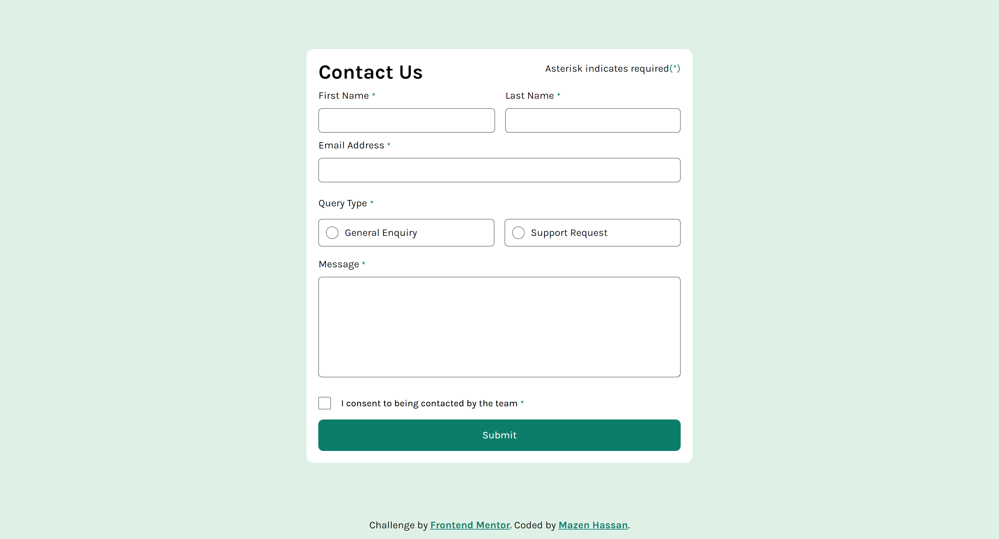

# Frontend Mentor - Contact form solution

This is a solution to the [Contact form challenge on Frontend Mentor](https://www.frontendmentor.io/challenges/contact-form--G-hYlqKJj). Frontend Mentor challenges help you improve your coding skills by building realistic projects.

## Table of contents

- [Frontend Mentor - Contact form solution](#frontend-mentor---contact-form-solution)
  - [Table of contents](#table-of-contents)
    - [The challenge](#the-challenge)
    - [Screenshot](#screenshot)
    - [Links](#links)
    - [Built with](#built-with)
    - [What I learned](#what-i-learned)
    - [Continued development](#continued-development)
    - [Useful resources](#useful-resources)
  - [Acknowledgments](#acknowledgments)

### The challenge

Users should be able to:

- Complete the form and see a success toast message upon successful submission
- Receive form validation messages if:
  - A required field has been missed
  - The email address is not formatted correctly
- Complete the form only using their keyboard
- Have inputs, error messages, and the success message announced on their screen reader
- View the optimal layout for the interface depending on their device's screen size
- See hover and focus states for all interactive elements on the page

### Screenshot

### Links

- Solution URL: [Solution URL]()
- Live Site URL: [Live site URL](https://contact-form-taupe.vercel.app/)

### Built with

- Semantic HTML5 markup
- CSS custom properties
- Flexbox
- CSS Grid
- Mobile-first workflow
- [React](https://reactjs.org/) - JS library
- [Styled Components](https://sass-lang.com/) - For styles

### What I learned

In this contact form validation challenge, I learned to properly check custom validity on forms and provide AT accessbility attributes:

- Validating form using `onSubmit` attribute instead of onClick callback on buttons (wrong approach I had in the past).
- Included extra accessibility attributes such as `aria-invalid`, `aria-required` and `aria-describedby`.
- Shifting focus to the first invalid input using `useRef` in React
- Notifying screen readers of successful toast message upon validated form using `aria-live` and `aria-relevant` as `text additions` for newly added elements in the DOM.

### Continued development

I am excited to improve my form validation skills wih a proper accessibility assitance for screen readers and a great user-friendly experience. Overall I'm delighted with the result and looking to learn new techniques in future projects.

### Useful resources

- [Aria-invalid on MDN](https://developer.mozilla.org/en-US/docs/Web/Accessibility/ARIA/Attributes/aria-invalid) - Using this attribute is really helpful for screen readers and while testing I noticed it clearly states the invalid field along required
- [Aria-live on MDN](https://developer.mozilla.org/en-US/docs/Web/Accessibility/ARIA/Attributes/aria-live) - This attribute is highly useful and I think I will get to use it again in future. It helped me communicate the success toast message upon confirmed validation. Really recommends looking into it.

## Acknowledgments

Thanks to frontendmentor discord community for answering questions and helping in project as much as possible!
